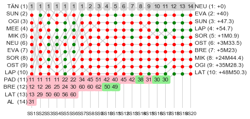

# Rally Report - Portugal

*This report is unofficial and is not associated in any way with the Fédération Internationale de l’Automobile (FIA) or WRC Promoter GmbH.*

Vodafone Rally de Portugal (2018-05-17 to 2018-05-20) runs over 20 competitive special stages. The distance covered on the special stages is 358.19km, with an overall rally distance of 1583.47km. The special stage surface type is predominantly Gravel.

