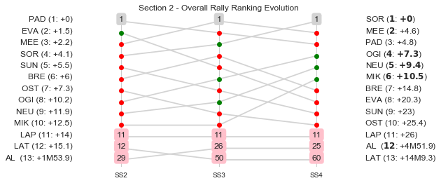

### Section 2 Report
Section 2

Section 2

Stage Result - SS2

|Driver|            Team             |Elapsed Duration|Position|Class Rank|   diffFirst    |    diffPrev    |
|------|-----------------------------|----------------|-------:|---------:|----------------|----------------|
|PAD   |HYUNDAI SHELL MOBIS WRT      |00:15:29.3000000|       1|         1|00:00:00        |00:00:00        |
|EVA   |M-SPORT FORD WORLD RALLY TEAM|00:15:31.6000000|       2|         2|00:00:02.3000000|00:00:02.3000000|
|MEE   |CITROEN TOTAL ABU DHABI WRT  |00:15:32.5000000|       3|         3|00:00:03.2000000|00:00:00.9000000|
|SOR   |HYUNDAI SHELL MOBIS WRT      |00:15:34.2000000|       4|         4|00:00:04.9000000|00:00:01.7000000|
|BRE   |CITROEN TOTAL ABU DHABI WRT  |00:15:35.2000000|       5|         5|00:00:05.9000000|00:00:01        |
|SUN   |M-SPORT FORD WORLD RALLY TEAM|00:15:36.8000000|       6|         6|00:00:07.5000000|00:00:01.6000000|
|OST   |CITROEN TOTAL ABU DHABI WRT  |00:15:37.3000000|       7|         7|00:00:08        |00:00:00.5000000|
|OGI   |M-SPORT FORD WORLD RALLY TEAM|00:15:41.5000000|       8|         8|00:00:12.2000000|00:00:04.2000000|
|NEU   |HYUNDAI SHELL MOBIS WRT      |00:15:42.1000000|       9|         9|00:00:12.8000000|00:00:00.6000000|
|MIK   |HYUNDAI SHELL MOBIS WRT      |00:15:42.8000000|      10|        10|00:00:13.5000000|00:00:00.7000000|
|LAT   |TOYOTA GAZOO RACING WRT      |00:15:42.9000000|      11|        11|00:00:13.6000000|00:00:00.1000000|
|LAP   |TOYOTA GAZOO RACING WRT      |00:15:43.9000000|      12|        12|00:00:14.6000000|00:00:01        |
|AL    |YAZEED RACING                |00:17:14.9000000|      29|        13|00:01:45.6000000|00:00:00.3000000|
|TÄN   |TOYOTA GAZOO RACING WRT      |                |     NaN|       NaN|                |                |

Stage Result - SS3

|Driver|            Team             |Elapsed Duration|Position|Class Rank|   diffFirst    |    diffPrev    |
|------|-----------------------------|----------------|-------:|---------:|----------------|----------------|
|MEE   |CITROEN TOTAL ABU DHABI WRT  |00:10:35.1000000|       1|         1|00:00:00        |00:00:00        |
|OGI   |M-SPORT FORD WORLD RALLY TEAM|00:10:36.2000000|       2|         2|00:00:01.1000000|00:00:01.1000000|
|NEU   |HYUNDAI SHELL MOBIS WRT      |00:10:36.3000000|       3|         3|00:00:01.2000000|00:00:00.1000000|
|SOR   |HYUNDAI SHELL MOBIS WRT      |00:10:36.8000000|       4|         4|00:00:01.7000000|00:00:00.5000000|
|MIK   |HYUNDAI SHELL MOBIS WRT      |00:10:38.6000000|       5|         5|00:00:03.5000000|00:00:01.8000000|
|BRE   |CITROEN TOTAL ABU DHABI WRT  |00:10:38.8000000|       6|         6|00:00:03.7000000|00:00:00.2000000|
|PAD   |HYUNDAI SHELL MOBIS WRT      |00:10:38.9000000|       7|         7|00:00:03.8000000|00:00:00.1000000|
|LAP   |TOYOTA GAZOO RACING WRT      |00:10:40        |       8|         8|00:00:04.9000000|00:00:01.1000000|
|SUN   |M-SPORT FORD WORLD RALLY TEAM|00:10:41.1000000|       9|         9|00:00:06        |00:00:01.1000000|
|OST   |CITROEN TOTAL ABU DHABI WRT  |00:10:43.3000000|      10|        10|00:00:08.2000000|00:00:02.2000000|
|EVA   |M-SPORT FORD WORLD RALLY TEAM|00:10:44.3000000|      11|        11|00:00:09.2000000|00:00:01        |
|AL    |YAZEED RACING                |00:11:43.4000000|      21|        12|00:01:08.3000000|00:00:07.4000000|
|LAT   |TOYOTA GAZOO RACING WRT      |                |     NaN|       NaN|                |                |
|TÄN   |TOYOTA GAZOO RACING WRT      |                |     NaN|       NaN|                |                |

Stage Result - SS4

|Driver|            Team             |Elapsed Duration|Position|Class Rank|   diffFirst    |    diffPrev    |
|------|-----------------------------|----------------|-------:|---------:|----------------|----------------|
|SOR   |HYUNDAI SHELL MOBIS WRT      |00:19:15.5000000|       1|         1|00:00:00        |00:00:00        |
|MIK   |HYUNDAI SHELL MOBIS WRT      |00:19:15.8000000|       2|         2|00:00:00.3000000|00:00:00.3000000|
|OGI   |M-SPORT FORD WORLD RALLY TEAM|00:19:17.3000000|       3|         3|00:00:01.8000000|00:00:01.5000000|
|NEU   |HYUNDAI SHELL MOBIS WRT      |00:19:17.6000000|       4|         4|00:00:02.1000000|00:00:00.3000000|
|MEE   |CITROEN TOTAL ABU DHABI WRT  |                |     NaN|       NaN|                |                |
|LAP   |TOYOTA GAZOO RACING WRT      |                |     NaN|       NaN|                |                |
|LAT   |TOYOTA GAZOO RACING WRT      |                |     NaN|       NaN|                |                |
|TÄN   |TOYOTA GAZOO RACING WRT      |                |     NaN|       NaN|                |                |
|EVA   |M-SPORT FORD WORLD RALLY TEAM|                |     NaN|       NaN|                |                |
|AL    |YAZEED RACING                |                |     NaN|       NaN|                |                |
|PAD   |HYUNDAI SHELL MOBIS WRT      |                |     NaN|       NaN|                |                |
|BRE   |CITROEN TOTAL ABU DHABI WRT  |                |     NaN|       NaN|                |                |
|SUN   |M-SPORT FORD WORLD RALLY TEAM|                |     NaN|       NaN|                |                |
|OST   |CITROEN TOTAL ABU DHABI WRT  |                |     NaN|       NaN|                |                |

### Section 2 Report
Section 2

Section 2

Stage Result - SS2

|Driver|            Team             |Elapsed Duration|Position|Class Rank|   diffFirst    |    diffPrev    |
|------|-----------------------------|----------------|-------:|---------:|----------------|----------------|
|PAD   |HYUNDAI SHELL MOBIS WRT      |00:15:29.3000000|       1|         1|00:00:00        |00:00:00        |
|EVA   |M-SPORT FORD WORLD RALLY TEAM|00:15:31.6000000|       2|         2|00:00:02.3000000|00:00:02.3000000|
|MEE   |CITROEN TOTAL ABU DHABI WRT  |00:15:32.5000000|       3|         3|00:00:03.2000000|00:00:00.9000000|
|SOR   |HYUNDAI SHELL MOBIS WRT      |00:15:34.2000000|       4|         4|00:00:04.9000000|00:00:01.7000000|
|BRE   |CITROEN TOTAL ABU DHABI WRT  |00:15:35.2000000|       5|         5|00:00:05.9000000|00:00:01        |
|SUN   |M-SPORT FORD WORLD RALLY TEAM|00:15:36.8000000|       6|         6|00:00:07.5000000|00:00:01.6000000|
|OST   |CITROEN TOTAL ABU DHABI WRT  |00:15:37.3000000|       7|         7|00:00:08        |00:00:00.5000000|
|OGI   |M-SPORT FORD WORLD RALLY TEAM|00:15:41.5000000|       8|         8|00:00:12.2000000|00:00:04.2000000|
|NEU   |HYUNDAI SHELL MOBIS WRT      |00:15:42.1000000|       9|         9|00:00:12.8000000|00:00:00.6000000|
|MIK   |HYUNDAI SHELL MOBIS WRT      |00:15:42.8000000|      10|        10|00:00:13.5000000|00:00:00.7000000|
|LAT   |TOYOTA GAZOO RACING WRT      |00:15:42.9000000|      11|        11|00:00:13.6000000|00:00:00.1000000|
|LAP   |TOYOTA GAZOO RACING WRT      |00:15:43.9000000|      12|        12|00:00:14.6000000|00:00:01        |
|AL    |YAZEED RACING                |00:17:14.9000000|      29|        13|00:01:45.6000000|00:00:00.3000000|
|TÄN   |TOYOTA GAZOO RACING WRT      |                |     NaN|       NaN|                |                |

Stage Result - SS3

|Driver|            Team             |Elapsed Duration|Position|Class Rank|   diffFirst    |    diffPrev    |
|------|-----------------------------|----------------|-------:|---------:|----------------|----------------|
|MEE   |CITROEN TOTAL ABU DHABI WRT  |00:10:35.1000000|       1|         1|00:00:00        |00:00:00        |
|OGI   |M-SPORT FORD WORLD RALLY TEAM|00:10:36.2000000|       2|         2|00:00:01.1000000|00:00:01.1000000|
|NEU   |HYUNDAI SHELL MOBIS WRT      |00:10:36.3000000|       3|         3|00:00:01.2000000|00:00:00.1000000|
|SOR   |HYUNDAI SHELL MOBIS WRT      |00:10:36.8000000|       4|         4|00:00:01.7000000|00:00:00.5000000|
|MIK   |HYUNDAI SHELL MOBIS WRT      |00:10:38.6000000|       5|         5|00:00:03.5000000|00:00:01.8000000|
|BRE   |CITROEN TOTAL ABU DHABI WRT  |00:10:38.8000000|       6|         6|00:00:03.7000000|00:00:00.2000000|
|PAD   |HYUNDAI SHELL MOBIS WRT      |00:10:38.9000000|       7|         7|00:00:03.8000000|00:00:00.1000000|
|LAP   |TOYOTA GAZOO RACING WRT      |00:10:40        |       8|         8|00:00:04.9000000|00:00:01.1000000|
|SUN   |M-SPORT FORD WORLD RALLY TEAM|00:10:41.1000000|       9|         9|00:00:06        |00:00:01.1000000|
|OST   |CITROEN TOTAL ABU DHABI WRT  |00:10:43.3000000|      10|        10|00:00:08.2000000|00:00:02.2000000|
|EVA   |M-SPORT FORD WORLD RALLY TEAM|00:10:44.3000000|      11|        11|00:00:09.2000000|00:00:01        |
|AL    |YAZEED RACING                |00:11:43.4000000|      21|        12|00:01:08.3000000|00:00:07.4000000|
|LAT   |TOYOTA GAZOO RACING WRT      |                |     NaN|       NaN|                |                |
|TÄN   |TOYOTA GAZOO RACING WRT      |                |     NaN|       NaN|                |                |

Stage Result - SS4

|Driver|            Team             |Elapsed Duration|Position|Class Rank|   diffFirst    |    diffPrev    |
|------|-----------------------------|----------------|-------:|---------:|----------------|----------------|
|SOR   |HYUNDAI SHELL MOBIS WRT      |00:19:15.5000000|       1|         1|00:00:00        |00:00:00        |
|MIK   |HYUNDAI SHELL MOBIS WRT      |00:19:15.8000000|       2|         2|00:00:00.3000000|00:00:00.3000000|
|OGI   |M-SPORT FORD WORLD RALLY TEAM|00:19:17.3000000|       3|         3|00:00:01.8000000|00:00:01.5000000|
|NEU   |HYUNDAI SHELL MOBIS WRT      |00:19:17.6000000|       4|         4|00:00:02.1000000|00:00:00.3000000|
|MEE   |CITROEN TOTAL ABU DHABI WRT  |                |     NaN|       NaN|                |                |
|LAP   |TOYOTA GAZOO RACING WRT      |                |     NaN|       NaN|                |                |
|LAT   |TOYOTA GAZOO RACING WRT      |                |     NaN|       NaN|                |                |
|TÄN   |TOYOTA GAZOO RACING WRT      |                |     NaN|       NaN|                |                |
|EVA   |M-SPORT FORD WORLD RALLY TEAM|                |     NaN|       NaN|                |                |
|AL    |YAZEED RACING                |                |     NaN|       NaN|                |                |
|PAD   |HYUNDAI SHELL MOBIS WRT      |                |     NaN|       NaN|                |                |
|BRE   |CITROEN TOTAL ABU DHABI WRT  |                |     NaN|       NaN|                |                |
|SUN   |M-SPORT FORD WORLD RALLY TEAM|                |     NaN|       NaN|                |                |
|OST   |CITROEN TOTAL ABU DHABI WRT  |                |     NaN|       NaN|                |                |

### Section 2 Report
Section 2

Section 2

Stage Result - SS2

|Driver|            Team             |Elapsed Duration|Position|Class Rank|   diffFirst    |    diffPrev    |
|------|-----------------------------|----------------|-------:|---------:|----------------|----------------|
|PAD   |HYUNDAI SHELL MOBIS WRT      |00:15:29.3000000|       1|         1|00:00:00        |00:00:00        |
|EVA   |M-SPORT FORD WORLD RALLY TEAM|00:15:31.6000000|       2|         2|00:00:02.3000000|00:00:02.3000000|
|MEE   |CITROEN TOTAL ABU DHABI WRT  |00:15:32.5000000|       3|         3|00:00:03.2000000|00:00:00.9000000|
|SOR   |HYUNDAI SHELL MOBIS WRT      |00:15:34.2000000|       4|         4|00:00:04.9000000|00:00:01.7000000|
|BRE   |CITROEN TOTAL ABU DHABI WRT  |00:15:35.2000000|       5|         5|00:00:05.9000000|00:00:01        |
|SUN   |M-SPORT FORD WORLD RALLY TEAM|00:15:36.8000000|       6|         6|00:00:07.5000000|00:00:01.6000000|
|OST   |CITROEN TOTAL ABU DHABI WRT  |00:15:37.3000000|       7|         7|00:00:08        |00:00:00.5000000|
|OGI   |M-SPORT FORD WORLD RALLY TEAM|00:15:41.5000000|       8|         8|00:00:12.2000000|00:00:04.2000000|
|NEU   |HYUNDAI SHELL MOBIS WRT      |00:15:42.1000000|       9|         9|00:00:12.8000000|00:00:00.6000000|
|MIK   |HYUNDAI SHELL MOBIS WRT      |00:15:42.8000000|      10|        10|00:00:13.5000000|00:00:00.7000000|
|LAT   |TOYOTA GAZOO RACING WRT      |00:15:42.9000000|      11|        11|00:00:13.6000000|00:00:00.1000000|
|LAP   |TOYOTA GAZOO RACING WRT      |00:15:43.9000000|      12|        12|00:00:14.6000000|00:00:01        |
|AL    |YAZEED RACING                |00:17:14.9000000|      29|        13|00:01:45.6000000|00:00:00.3000000|
|TÄN   |TOYOTA GAZOO RACING WRT      |                |     NaN|       NaN|                |                |

Stage Result - SS3

|Driver|            Team             |Elapsed Duration|Position|Class Rank|   diffFirst    |    diffPrev    |
|------|-----------------------------|----------------|-------:|---------:|----------------|----------------|
|MEE   |CITROEN TOTAL ABU DHABI WRT  |00:10:35.1000000|       1|         1|00:00:00        |00:00:00        |
|OGI   |M-SPORT FORD WORLD RALLY TEAM|00:10:36.2000000|       2|         2|00:00:01.1000000|00:00:01.1000000|
|NEU   |HYUNDAI SHELL MOBIS WRT      |00:10:36.3000000|       3|         3|00:00:01.2000000|00:00:00.1000000|
|SOR   |HYUNDAI SHELL MOBIS WRT      |00:10:36.8000000|       4|         4|00:00:01.7000000|00:00:00.5000000|
|MIK   |HYUNDAI SHELL MOBIS WRT      |00:10:38.6000000|       5|         5|00:00:03.5000000|00:00:01.8000000|
|BRE   |CITROEN TOTAL ABU DHABI WRT  |00:10:38.8000000|       6|         6|00:00:03.7000000|00:00:00.2000000|
|PAD   |HYUNDAI SHELL MOBIS WRT      |00:10:38.9000000|       7|         7|00:00:03.8000000|00:00:00.1000000|
|LAP   |TOYOTA GAZOO RACING WRT      |00:10:40        |       8|         8|00:00:04.9000000|00:00:01.1000000|
|SUN   |M-SPORT FORD WORLD RALLY TEAM|00:10:41.1000000|       9|         9|00:00:06        |00:00:01.1000000|
|OST   |CITROEN TOTAL ABU DHABI WRT  |00:10:43.3000000|      10|        10|00:00:08.2000000|00:00:02.2000000|
|EVA   |M-SPORT FORD WORLD RALLY TEAM|00:10:44.3000000|      11|        11|00:00:09.2000000|00:00:01        |
|AL    |YAZEED RACING                |00:11:43.4000000|      21|        12|00:01:08.3000000|00:00:07.4000000|
|LAT   |TOYOTA GAZOO RACING WRT      |                |     NaN|       NaN|                |                |
|TÄN   |TOYOTA GAZOO RACING WRT      |                |     NaN|       NaN|                |                |

Stage Result - SS4

|Driver|            Team             |Elapsed Duration|Position|Class Rank|   diffFirst    |    diffPrev    |
|------|-----------------------------|----------------|-------:|---------:|----------------|----------------|
|SOR   |HYUNDAI SHELL MOBIS WRT      |00:19:15.5000000|       1|         1|00:00:00        |00:00:00        |
|MIK   |HYUNDAI SHELL MOBIS WRT      |00:19:15.8000000|       2|         2|00:00:00.3000000|00:00:00.3000000|
|OGI   |M-SPORT FORD WORLD RALLY TEAM|00:19:17.3000000|       3|         3|00:00:01.8000000|00:00:01.5000000|
|NEU   |HYUNDAI SHELL MOBIS WRT      |00:19:17.6000000|       4|         4|00:00:02.1000000|00:00:00.3000000|
|MEE   |CITROEN TOTAL ABU DHABI WRT  |                |     NaN|       NaN|                |                |
|LAP   |TOYOTA GAZOO RACING WRT      |                |     NaN|       NaN|                |                |
|LAT   |TOYOTA GAZOO RACING WRT      |                |     NaN|       NaN|                |                |
|TÄN   |TOYOTA GAZOO RACING WRT      |                |     NaN|       NaN|                |                |
|EVA   |M-SPORT FORD WORLD RALLY TEAM|                |     NaN|       NaN|                |                |
|AL    |YAZEED RACING                |                |     NaN|       NaN|                |                |
|PAD   |HYUNDAI SHELL MOBIS WRT      |                |     NaN|       NaN|                |                |
|BRE   |CITROEN TOTAL ABU DHABI WRT  |                |     NaN|       NaN|                |                |
|SUN   |M-SPORT FORD WORLD RALLY TEAM|                |     NaN|       NaN|                |                |
|OST   |CITROEN TOTAL ABU DHABI WRT  |                |     NaN|       NaN|                |                |

### Section 2 Report
Section 2

Section 2

Stage Result - SS2

|Driver|            Team             |Elapsed Duration|Position|Class Rank|   diffFirst    |    diffPrev    |
|------|-----------------------------|----------------|-------:|---------:|----------------|----------------|
|PAD   |HYUNDAI SHELL MOBIS WRT      |00:15:29.3000000|       1|         1|00:00:00        |00:00:00        |
|EVA   |M-SPORT FORD WORLD RALLY TEAM|00:15:31.6000000|       2|         2|00:00:02.3000000|00:00:02.3000000|
|MEE   |CITROEN TOTAL ABU DHABI WRT  |00:15:32.5000000|       3|         3|00:00:03.2000000|00:00:00.9000000|
|SOR   |HYUNDAI SHELL MOBIS WRT      |00:15:34.2000000|       4|         4|00:00:04.9000000|00:00:01.7000000|
|BRE   |CITROEN TOTAL ABU DHABI WRT  |00:15:35.2000000|       5|         5|00:00:05.9000000|00:00:01        |
|SUN   |M-SPORT FORD WORLD RALLY TEAM|00:15:36.8000000|       6|         6|00:00:07.5000000|00:00:01.6000000|
|OST   |CITROEN TOTAL ABU DHABI WRT  |00:15:37.3000000|       7|         7|00:00:08        |00:00:00.5000000|
|OGI   |M-SPORT FORD WORLD RALLY TEAM|00:15:41.5000000|       8|         8|00:00:12.2000000|00:00:04.2000000|
|NEU   |HYUNDAI SHELL MOBIS WRT      |00:15:42.1000000|       9|         9|00:00:12.8000000|00:00:00.6000000|
|MIK   |HYUNDAI SHELL MOBIS WRT      |00:15:42.8000000|      10|        10|00:00:13.5000000|00:00:00.7000000|
|LAT   |TOYOTA GAZOO RACING WRT      |00:15:42.9000000|      11|        11|00:00:13.6000000|00:00:00.1000000|
|LAP   |TOYOTA GAZOO RACING WRT      |00:15:43.9000000|      12|        12|00:00:14.6000000|00:00:01        |
|AL    |YAZEED RACING                |00:17:14.9000000|      29|        13|00:01:45.6000000|00:00:00.3000000|
|TÄN   |TOYOTA GAZOO RACING WRT      |                |     NaN|       NaN|                |                |

Stage Result - SS3

|Driver|            Team             |Elapsed Duration|Position|Class Rank|   diffFirst    |    diffPrev    |
|------|-----------------------------|----------------|-------:|---------:|----------------|----------------|
|MEE   |CITROEN TOTAL ABU DHABI WRT  |00:10:35.1000000|       1|         1|00:00:00        |00:00:00        |
|OGI   |M-SPORT FORD WORLD RALLY TEAM|00:10:36.2000000|       2|         2|00:00:01.1000000|00:00:01.1000000|
|NEU   |HYUNDAI SHELL MOBIS WRT      |00:10:36.3000000|       3|         3|00:00:01.2000000|00:00:00.1000000|
|SOR   |HYUNDAI SHELL MOBIS WRT      |00:10:36.8000000|       4|         4|00:00:01.7000000|00:00:00.5000000|
|MIK   |HYUNDAI SHELL MOBIS WRT      |00:10:38.6000000|       5|         5|00:00:03.5000000|00:00:01.8000000|
|BRE   |CITROEN TOTAL ABU DHABI WRT  |00:10:38.8000000|       6|         6|00:00:03.7000000|00:00:00.2000000|
|PAD   |HYUNDAI SHELL MOBIS WRT      |00:10:38.9000000|       7|         7|00:00:03.8000000|00:00:00.1000000|
|LAP   |TOYOTA GAZOO RACING WRT      |00:10:40        |       8|         8|00:00:04.9000000|00:00:01.1000000|
|SUN   |M-SPORT FORD WORLD RALLY TEAM|00:10:41.1000000|       9|         9|00:00:06        |00:00:01.1000000|
|OST   |CITROEN TOTAL ABU DHABI WRT  |00:10:43.3000000|      10|        10|00:00:08.2000000|00:00:02.2000000|
|EVA   |M-SPORT FORD WORLD RALLY TEAM|00:10:44.3000000|      11|        11|00:00:09.2000000|00:00:01        |
|AL    |YAZEED RACING                |00:11:43.4000000|      25|        12|00:01:08.3000000|00:00:00.8000000|
|LAT   |TOYOTA GAZOO RACING WRT      |                |     NaN|       NaN|                |                |
|TÄN   |TOYOTA GAZOO RACING WRT      |                |     NaN|       NaN|                |                |

Stage Result - SS4

|Driver|            Team             |Elapsed Duration|Position|Class Rank|   diffFirst    |    diffPrev    |
|------|-----------------------------|----------------|-------:|---------:|----------------|----------------|
|SOR   |HYUNDAI SHELL MOBIS WRT      |00:19:15.5000000|       1|         1|00:00:00        |00:00:00        |
|MIK   |HYUNDAI SHELL MOBIS WRT      |00:19:15.8000000|       2|         2|00:00:00.3000000|00:00:00.3000000|
|OGI   |M-SPORT FORD WORLD RALLY TEAM|00:19:17.3000000|       3|         3|00:00:01.8000000|00:00:01.5000000|
|NEU   |HYUNDAI SHELL MOBIS WRT      |00:19:17.6000000|       4|         4|00:00:02.1000000|00:00:00.3000000|
|PAD   |HYUNDAI SHELL MOBIS WRT      |00:19:22.3000000|       5|         5|00:00:06.8000000|00:00:04.7000000|
|MEE   |CITROEN TOTAL ABU DHABI WRT  |00:19:23.7000000|       6|         6|00:00:08.2000000|00:00:01.4000000|
|BRE   |CITROEN TOTAL ABU DHABI WRT  |00:19:26.4000000|       7|         7|00:00:10.9000000|00:00:02.7000000|
|LAP   |TOYOTA GAZOO RACING WRT      |00:19:28.4000000|       8|         8|00:00:12.9000000|00:00:02        |
|EVA   |M-SPORT FORD WORLD RALLY TEAM|00:19:30.9000000|       9|         9|00:00:15.4000000|00:00:02.5000000|
|OST   |CITROEN TOTAL ABU DHABI WRT  |00:19:31.2000000|      10|        10|00:00:15.7000000|00:00:00.3000000|
|SUN   |M-SPORT FORD WORLD RALLY TEAM|00:19:32.8000000|      11|        11|00:00:17.3000000|00:00:01.6000000|
|AL    |YAZEED RACING                |00:21:11        |      19|        12|00:01:55.5000000|00:00:10.2000000|
|LAT   |TOYOTA GAZOO RACING WRT      |                |     NaN|       NaN|                |                |
|TÄN   |TOYOTA GAZOO RACING WRT      |                |     NaN|       NaN|                |                |

### Section 2 Report
Section 2

Section 2

Stage Result - SS2

|Driver|            Team             |Elapsed Duration|Position|Class Rank|   diffFirst    |    diffPrev    |
|------|-----------------------------|----------------|-------:|---------:|----------------|----------------|
|PAD   |HYUNDAI SHELL MOBIS WRT      |00:15:29.3000000|       1|         1|00:00:00        |00:00:00        |
|EVA   |M-SPORT FORD WORLD RALLY TEAM|00:15:31.6000000|       2|         2|00:00:02.3000000|00:00:02.3000000|
|MEE   |CITROEN TOTAL ABU DHABI WRT  |00:15:32.5000000|       3|         3|00:00:03.2000000|00:00:00.9000000|
|SOR   |HYUNDAI SHELL MOBIS WRT      |00:15:34.2000000|       4|         4|00:00:04.9000000|00:00:01.7000000|
|BRE   |CITROEN TOTAL ABU DHABI WRT  |00:15:35.2000000|       5|         5|00:00:05.9000000|00:00:01        |
|SUN   |M-SPORT FORD WORLD RALLY TEAM|00:15:36.8000000|       6|         6|00:00:07.5000000|00:00:01.6000000|
|OST   |CITROEN TOTAL ABU DHABI WRT  |00:15:37.3000000|       7|         7|00:00:08        |00:00:00.5000000|
|OGI   |M-SPORT FORD WORLD RALLY TEAM|00:15:41.5000000|       8|         8|00:00:12.2000000|00:00:04.2000000|
|NEU   |HYUNDAI SHELL MOBIS WRT      |00:15:42.1000000|       9|         9|00:00:12.8000000|00:00:00.6000000|
|MIK   |HYUNDAI SHELL MOBIS WRT      |00:15:42.8000000|      10|        10|00:00:13.5000000|00:00:00.7000000|
|LAT   |TOYOTA GAZOO RACING WRT      |00:15:42.9000000|      11|        11|00:00:13.6000000|00:00:00.1000000|
|LAP   |TOYOTA GAZOO RACING WRT      |00:15:43.9000000|      12|        12|00:00:14.6000000|00:00:01        |
|AL    |YAZEED RACING                |00:17:14.9000000|      29|        13|00:01:45.6000000|00:00:00.3000000|
|TÄN   |TOYOTA GAZOO RACING WRT      |                |     NaN|       NaN|                |                |

Stage Result - SS3

|Driver|            Team             |Elapsed Duration|Position|Class Rank|   diffFirst    |    diffPrev    |
|------|-----------------------------|----------------|-------:|---------:|----------------|----------------|
|MEE   |CITROEN TOTAL ABU DHABI WRT  |00:10:35.1000000|       1|         1|00:00:00        |00:00:00        |
|OGI   |M-SPORT FORD WORLD RALLY TEAM|00:10:36.2000000|       2|         2|00:00:01.1000000|00:00:01.1000000|
|NEU   |HYUNDAI SHELL MOBIS WRT      |00:10:36.3000000|       3|         3|00:00:01.2000000|00:00:00.1000000|
|SOR   |HYUNDAI SHELL MOBIS WRT      |00:10:36.8000000|       4|         4|00:00:01.7000000|00:00:00.5000000|
|MIK   |HYUNDAI SHELL MOBIS WRT      |00:10:38.6000000|       5|         5|00:00:03.5000000|00:00:01.8000000|
|BRE   |CITROEN TOTAL ABU DHABI WRT  |00:10:38.8000000|       6|         6|00:00:03.7000000|00:00:00.2000000|
|PAD   |HYUNDAI SHELL MOBIS WRT      |00:10:38.9000000|       7|         7|00:00:03.8000000|00:00:00.1000000|
|LAP   |TOYOTA GAZOO RACING WRT      |00:10:40        |       8|         8|00:00:04.9000000|00:00:01.1000000|
|SUN   |M-SPORT FORD WORLD RALLY TEAM|00:10:41.1000000|       9|         9|00:00:06        |00:00:01.1000000|
|OST   |CITROEN TOTAL ABU DHABI WRT  |00:10:43.3000000|      10|        10|00:00:08.2000000|00:00:02.2000000|
|EVA   |M-SPORT FORD WORLD RALLY TEAM|00:10:44.3000000|      11|        11|00:00:09.2000000|00:00:01        |
|AL    |YAZEED RACING                |00:11:43.4000000|      25|        12|00:01:08.3000000|00:00:00.8000000|
|LAT   |TOYOTA GAZOO RACING WRT      |                |     NaN|       NaN|                |                |
|TÄN   |TOYOTA GAZOO RACING WRT      |                |     NaN|       NaN|                |                |

Stage Result - SS4

|Driver|            Team             |Elapsed Duration|Position|Class Rank|   diffFirst    |    diffPrev    |
|------|-----------------------------|----------------|-------:|---------:|----------------|----------------|
|SOR   |HYUNDAI SHELL MOBIS WRT      |00:19:15.5000000|       1|         1|00:00:00        |00:00:00        |
|MIK   |HYUNDAI SHELL MOBIS WRT      |00:19:15.8000000|       2|         2|00:00:00.3000000|00:00:00.3000000|
|OGI   |M-SPORT FORD WORLD RALLY TEAM|00:19:17.3000000|       3|         3|00:00:01.8000000|00:00:01.5000000|
|NEU   |HYUNDAI SHELL MOBIS WRT      |00:19:17.6000000|       4|         4|00:00:02.1000000|00:00:00.3000000|
|PAD   |HYUNDAI SHELL MOBIS WRT      |00:19:22.3000000|       5|         5|00:00:06.8000000|00:00:04.7000000|
|MEE   |CITROEN TOTAL ABU DHABI WRT  |00:19:23.7000000|       6|         6|00:00:08.2000000|00:00:01.4000000|
|BRE   |CITROEN TOTAL ABU DHABI WRT  |00:19:26.4000000|       7|         7|00:00:10.9000000|00:00:02.7000000|
|LAP   |TOYOTA GAZOO RACING WRT      |00:19:28.4000000|       8|         8|00:00:12.9000000|00:00:02        |
|EVA   |M-SPORT FORD WORLD RALLY TEAM|00:19:30.9000000|       9|         9|00:00:15.4000000|00:00:02.5000000|
|OST   |CITROEN TOTAL ABU DHABI WRT  |00:19:31.2000000|      10|        10|00:00:15.7000000|00:00:00.3000000|
|SUN   |M-SPORT FORD WORLD RALLY TEAM|00:19:32.8000000|      11|        11|00:00:17.3000000|00:00:01.6000000|
|AL    |YAZEED RACING                |00:21:11        |      19|        12|00:01:55.5000000|00:00:10.2000000|
|LAT   |TOYOTA GAZOO RACING WRT      |                |     NaN|       NaN|                |                |
|TÄN   |TOYOTA GAZOO RACING WRT      |                |     NaN|       NaN|                |                |

### Section 2 Report
Section 2

Section 2

Stage Result - SS2

|Driver|            Team             |Elapsed Duration|Position|Class Rank|   diffFirst    |    diffPrev    |
|------|-----------------------------|----------------|-------:|---------:|----------------|----------------|
|PAD   |HYUNDAI SHELL MOBIS WRT      |00:15:29.3000000|       1|         1|00:00:00        |00:00:00        |
|EVA   |M-SPORT FORD WORLD RALLY TEAM|00:15:31.6000000|       2|         2|00:00:02.3000000|00:00:02.3000000|
|MEE   |CITROEN TOTAL ABU DHABI WRT  |00:15:32.5000000|       3|         3|00:00:03.2000000|00:00:00.9000000|
|SOR   |HYUNDAI SHELL MOBIS WRT      |00:15:34.2000000|       4|         4|00:00:04.9000000|00:00:01.7000000|
|BRE   |CITROEN TOTAL ABU DHABI WRT  |00:15:35.2000000|       5|         5|00:00:05.9000000|00:00:01        |
|SUN   |M-SPORT FORD WORLD RALLY TEAM|00:15:36.8000000|       6|         6|00:00:07.5000000|00:00:01.6000000|
|OST   |CITROEN TOTAL ABU DHABI WRT  |00:15:37.3000000|       7|         7|00:00:08        |00:00:00.5000000|
|OGI   |M-SPORT FORD WORLD RALLY TEAM|00:15:41.5000000|       8|         8|00:00:12.2000000|00:00:04.2000000|
|NEU   |HYUNDAI SHELL MOBIS WRT      |00:15:42.1000000|       9|         9|00:00:12.8000000|00:00:00.6000000|
|MIK   |HYUNDAI SHELL MOBIS WRT      |00:15:42.8000000|      10|        10|00:00:13.5000000|00:00:00.7000000|
|LAT   |TOYOTA GAZOO RACING WRT      |00:15:42.9000000|      11|        11|00:00:13.6000000|00:00:00.1000000|
|LAP   |TOYOTA GAZOO RACING WRT      |00:15:43.9000000|      12|        12|00:00:14.6000000|00:00:01        |
|AL    |YAZEED RACING                |00:17:14.9000000|      29|        13|00:01:45.6000000|00:00:00.3000000|
|TÄN   |TOYOTA GAZOO RACING WRT      |                |     NaN|       NaN|                |                |

Stage Result - SS3

|Driver|            Team             |Elapsed Duration|Position|Class Rank|   diffFirst    |    diffPrev    |
|------|-----------------------------|----------------|-------:|---------:|----------------|----------------|
|MEE   |CITROEN TOTAL ABU DHABI WRT  |00:10:35.1000000|       1|         1|00:00:00        |00:00:00        |
|OGI   |M-SPORT FORD WORLD RALLY TEAM|00:10:36.2000000|       2|         2|00:00:01.1000000|00:00:01.1000000|
|NEU   |HYUNDAI SHELL MOBIS WRT      |00:10:36.3000000|       3|         3|00:00:01.2000000|00:00:00.1000000|
|SOR   |HYUNDAI SHELL MOBIS WRT      |00:10:36.8000000|       4|         4|00:00:01.7000000|00:00:00.5000000|
|MIK   |HYUNDAI SHELL MOBIS WRT      |00:10:38.6000000|       5|         5|00:00:03.5000000|00:00:01.8000000|
|BRE   |CITROEN TOTAL ABU DHABI WRT  |00:10:38.8000000|       6|         6|00:00:03.7000000|00:00:00.2000000|
|PAD   |HYUNDAI SHELL MOBIS WRT      |00:10:38.9000000|       7|         7|00:00:03.8000000|00:00:00.1000000|
|LAP   |TOYOTA GAZOO RACING WRT      |00:10:40        |       8|         8|00:00:04.9000000|00:00:01.1000000|
|SUN   |M-SPORT FORD WORLD RALLY TEAM|00:10:41.1000000|       9|         9|00:00:06        |00:00:01.1000000|
|OST   |CITROEN TOTAL ABU DHABI WRT  |00:10:43.3000000|      10|        10|00:00:08.2000000|00:00:02.2000000|
|EVA   |M-SPORT FORD WORLD RALLY TEAM|00:10:44.3000000|      11|        11|00:00:09.2000000|00:00:01        |
|AL    |YAZEED RACING                |00:11:43.4000000|      25|        12|00:01:08.3000000|00:00:00.8000000|
|LAT   |TOYOTA GAZOO RACING WRT      |                |     NaN|       NaN|                |                |
|TÄN   |TOYOTA GAZOO RACING WRT      |                |     NaN|       NaN|                |                |

Stage Result - SS4

|Driver|            Team             |Elapsed Duration|Position|Class Rank|   diffFirst    |    diffPrev    |
|------|-----------------------------|----------------|-------:|---------:|----------------|----------------|
|SOR   |HYUNDAI SHELL MOBIS WRT      |00:19:15.5000000|       1|         1|00:00:00        |00:00:00        |
|MIK   |HYUNDAI SHELL MOBIS WRT      |00:19:15.8000000|       2|         2|00:00:00.3000000|00:00:00.3000000|
|OGI   |M-SPORT FORD WORLD RALLY TEAM|00:19:17.3000000|       3|         3|00:00:01.8000000|00:00:01.5000000|
|NEU   |HYUNDAI SHELL MOBIS WRT      |00:19:17.6000000|       4|         4|00:00:02.1000000|00:00:00.3000000|
|PAD   |HYUNDAI SHELL MOBIS WRT      |00:19:22.3000000|       5|         5|00:00:06.8000000|00:00:04.7000000|
|MEE   |CITROEN TOTAL ABU DHABI WRT  |00:19:23.7000000|       6|         6|00:00:08.2000000|00:00:01.4000000|
|BRE   |CITROEN TOTAL ABU DHABI WRT  |00:19:26.4000000|       7|         7|00:00:10.9000000|00:00:02.7000000|
|LAP   |TOYOTA GAZOO RACING WRT      |00:19:28.4000000|       8|         8|00:00:12.9000000|00:00:02        |
|EVA   |M-SPORT FORD WORLD RALLY TEAM|00:19:30.9000000|       9|         9|00:00:15.4000000|00:00:02.5000000|
|OST   |CITROEN TOTAL ABU DHABI WRT  |00:19:31.2000000|      10|        10|00:00:15.7000000|00:00:00.3000000|
|SUN   |M-SPORT FORD WORLD RALLY TEAM|00:19:32.8000000|      11|        11|00:00:17.3000000|00:00:01.6000000|
|AL    |YAZEED RACING                |00:21:11        |      19|        12|00:01:55.5000000|00:00:10.2000000|
|LAT   |TOYOTA GAZOO RACING WRT      |                |     NaN|       NaN|                |                |
|TÄN   |TOYOTA GAZOO RACING WRT      |                |     NaN|       NaN|                |                |

